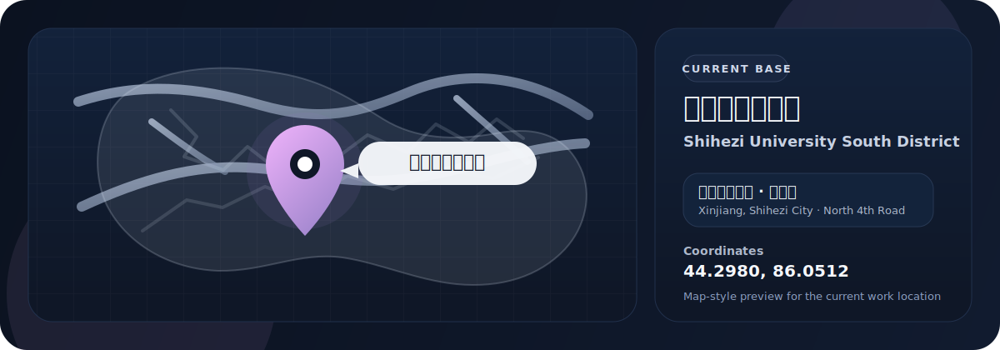
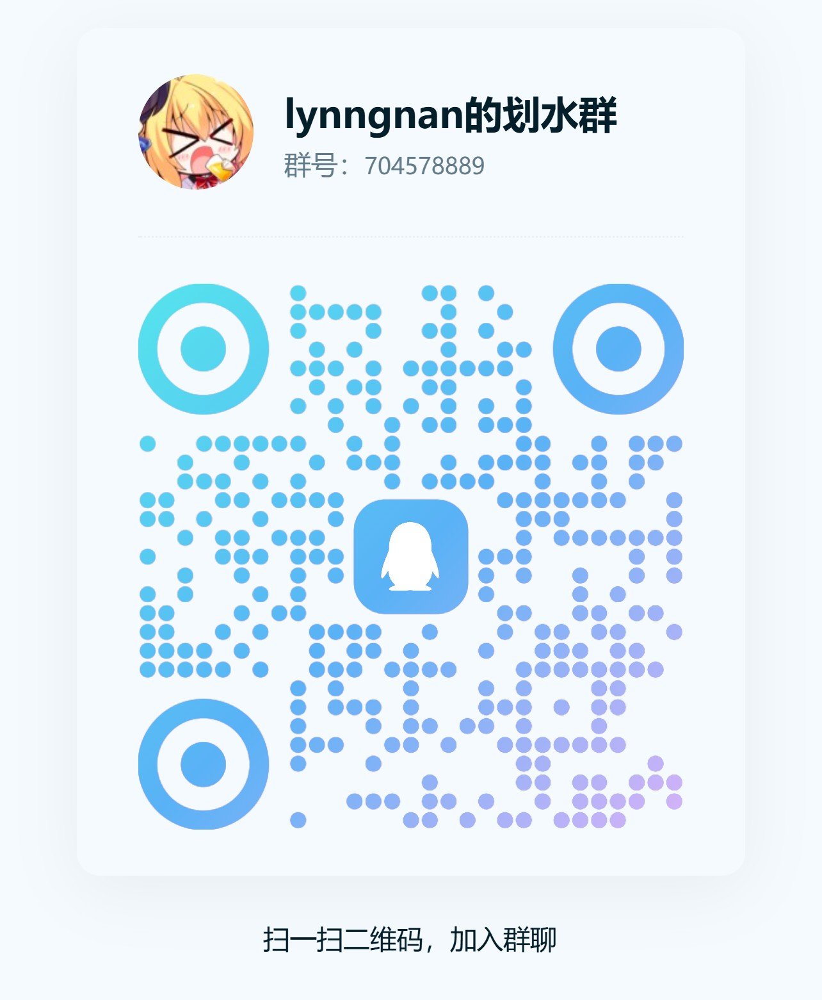

<table>
<tr>
<td width="68%" valign="middle">

<h2 align="left">✦ 你好，我是 LynngNAN / Hi, I'm LynngNAN ✦</h2>

<strong>面向 AI 应用、数字人交互与全栈实践的开发者</strong> 
<strong>A developer focused on AI applications, interactive digital characters, and full-stack building</strong>

  

</td>
<td width="32%" align="center" valign="middle">
  
   
  AI Application Builder · Java Full-Stack Developer · Live2D Explorer
</td>
</tr>
</table>

  
  
  
  

---

<table>
<tr>
<td width="64%" valign="top">

<h2>🌸 关于我 / About Me</h2>

<blockquote>
  
<strong>“希望把技术做得更有温度，也更有灵魂。”</strong> 
  <strong>“I want to build technology that feels warmer, more expressive, and more alive.”</strong>

</blockquote>

<ul>
  <li>🎓 目前就读于 <strong>石河子大学</strong> / Studying at <strong>Shihezi University</strong></li>
  <li>🔬 关注 <strong>LLM 应用、幻觉分析、RAG、Agent 系统与智能交互</strong> / Interested in <strong>LLM applications, hallucination analysis, RAG, agent systems, and intelligent interaction</strong></li>
  <li>🎭 对 <strong>Live2D、数字人、AI 陪伴、表情驱动与拟人化交互</strong> 持续探索 / Exploring <strong>Live2D, digital humans, AI companions, emotion-driven interaction, and character-driven systems</strong></li>
  <li>🧩 喜欢把研究兴趣变成可运行的原型 / Enjoy turning research ideas into working prototypes</li>
</ul>

</td>
<td width="36%" valign="top">

<h2>🗺 工作地点 / Work Location</h2>

  

<table>
  <tr>
    <td><strong>当前</strong></td>
    <td>新疆 / 线上</td>
  </tr>
  <tr>
    <td><strong>可工作地点</strong></td>
    <td>江浙沪 / 广东 / 海南 / 川渝 / remote</td>
  </tr>
</table>

</td>
</tr>
</table>

<table>
<tr>
<td width="34%" align="center" valign="middle">
  
</td>
<td width="66%" valign="top">

<h2>🌙 月见天音 / Tsukimiamane</h2>

<strong>我的个人 AI 助理 / My personal AI assistant</strong>

<ul>
  <li>协助 vibecoding、代码评审与日常协作 / Helps with vibecoding, code review, and daily collaboration</li>
</ul>

</td>
</tr>
</table>

---

## ✨ 我在做什么 / What I Build

- **AI 应用 / AI Applications**: LLM integration / agent workflows / practical AI tools
- **交互系统 / Interactive Systems**: Live2D / emotion control / WebSocket interaction
- **全栈项目 / Full-Stack Projects**: Java backend + database + web frontend
- **个人产品 / Personal Products**: websites, productivity tools, and experimental software

---

## 🛠 技术栈 / Tech Stack

<table>
  <tr>
    <td width="50%" valign="top">
      <h4>Languages</h4>
      

    </td>
    <td width="50%" valign="top">
      <h4>Backend & Database</h4>
      

    </td>
  </tr>
  <tr>
    <td width="50%" valign="top">
      <h4>Frontend & Interaction</h4>
      

    </td>
    <td width="50%" valign="top">
      <h4>Tools & Workflow</h4>
      

    </td>
  </tr>
</table>

---

## 💫 代表项目 / Featured Projects

### 1. [SoulLink_Live2D](https://github.com/nanlingyin/SoulLink_Live2D)

> LLM 驱动的 Live2D 交互项目 / LLM-driven Live2D interaction project

- 基于对话内容生成情绪与语义反馈 / Generates emotion and semantic responses from dialogue
- 驱动 Live2D 参数与表情变化 / Controls Live2D parameters and expression states in real time
- 支持 WebSocket 通信、多模型加载与参数过渡 / Supports WebSocket communication, multi-model loading, and parameter transitions

### 2. [study_planner](https://github.com/nanlingyin/study_planner)

> 智能学习规划平台 / Intelligent Study Planning Platform

- 基于 **Spring Boot + MyBatis + MySQL + LLM API** 构建 / Built with **Spring Boot + MyBatis + MySQL + LLM API**
- 包含规划、记录、统计与辅助功能 / Includes planning, tracking, analytics, and assistant features
- 首次采用 GitHub Organization 协作形式开发，负责 PR 审查与管理 / First project developed in a GitHub organization; handled PR review and management

### 3. [fishtime](https://github.com/nanlingyin/fishtime)

> 效率与时间追踪工具 / Productivity and Time Tracking Tool

- 自动记录使用时长，辅助分析时间分配 / Automatically tracks usage time and helps analyze personal productivity
- 面向个人时间管理场景 / Built for personal time management scenarios

### 4. [Lynnnet](https://github.com/nanlingyin/Lynnnet)

> 个人网站 / Personal Website

- 用于展示作品、内容和个人信息 / A personal hub for projects, content, and profile information

---

## 📈 GitHub 数据 / GitHub Snapshot

  
  

  

---

## 🎯 目前关注 / Current Focus

* 🤖 构建更完整的 **AI 驱动产品原型** / Building more complete **AI-powered product prototypes**
* 🎭 探索 **LLM × Live2D × 情绪交互** 的结合方式 / Exploring the intersection of **LLM × Live2D × expressive interaction**
* 🧱 持续提升 **Java 后端工程能力** 与项目完整度 / Improving **Java backend engineering** and end-to-end project quality
* 🌌 把研究兴趣慢慢变成真正可部署、可体验的系统 / Turning research curiosity into systems that can actually be deployed and experienced

---

## 🤝 与我联系 / Connect With Me

  
如果你想联系我，可以先看下面这些方式，也欢迎扫码加入我的划水群。

  <table align="center" width="760">
  <tr>
  <td width="58%" valign="top">

  

    个人网站：<a href="https://lynngnan.top">https://lynngnan.top</a> 
    ORCID 主页：<a href="https://orcid.org/0009-0003-2138-6088">https://orcid.org/0009-0003-2138-6088</a> 
    Bilibili 主页：<a href="https://space.bilibili.com/349707254">https://space.bilibili.com/349707254</a> 
    邮箱联系：<a href="mailto:20241008398@stu.shzu.edu.cn">20241008398@stu.shzu.edu.cn</a>
  

  </td>
  <td width="42%" align="center" valign="top">
    
     
    <strong>我的划水群</strong>
  </td>
  </tr>
  </table>

---

### 🌙「在代码与想象之间，创造可以被感受到的东西」

### *Build things that are not only functional, but also felt.*

